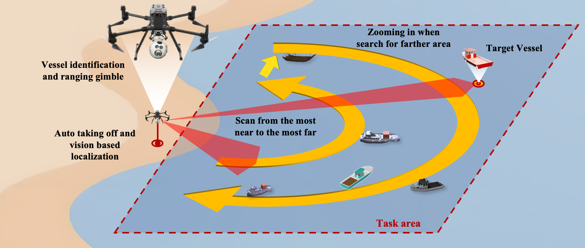

# Vessel_det

> Real-time UAV-based vessel detection and **dynamic camera control** for efficient maritime search.  
> This repository contains two ROS packages:  
> - **spirecv-ros** — vessel detection and candidate prioritization  
> - **pod_search** — dynamic camera/gimbal control and search pattern execution  

---

## Overview
This codebase implements the pipeline described in:

**Prioritized Real-Time UAV-Based Vessel Detection for Efficient Maritime Search**  
*Journal of Field Robotics, 2025*  
[📄 View Paper (Wiley)](https://onlinelibrary.wiley.com/doi/abs/10.1002/rob.70048)  

The system couples **real-time detection** with **feature-based prioritization** (ResNet50 embeddings + cosine similarity) and **dynamic gimbal control** guided by predefined search patterns, historical cues, and live sensor inputs (e.g., radar/LiDAR). The outcome is a practical UAV workflow that reduces blind spots and accelerates target confirmation.

---

## Repository Structure

- spirecv-ros/ — Vessel detection & prioritization (ROS)
  - launch/
  - config/
  - src/
  - msg/ (optional)
- pod_search/ — Dynamic camera control & search manager (ROS)
  - launch/
  - config/
  - src/
- scripts/ — Utilities (bag to video, metrics, etc.)
- docs/ — Diagrams, interface specs, figures
- README.md

---

## Core Features
- Real-time vessel detection with YOLO/ONNX or OpenCV DNN.  
- Feature-based prioritization using ResNet50 embeddings + cosine similarity.  
- Dynamic gimbal control (yaw/pitch) with search patterns and live cues.  
- ROS-native interfaces for UAV autopilot integration.  
- Config-first design with YAML parameterization.  
- Logging & evaluation of detections, priorities, and gimbal commands.  

---

## Quick Start

**Prerequisites**  
- ROS 2 (tested with Humble/Foxy)  
- Python 3.8+  
- OpenCV, NumPy, PyTorch  
- ONNX Runtime or TensorRT (optional)  

**Setup**  
1. Create workspace: `mkdir -p ~/vessel_ws/src`  
2. Clone: `git clone https://github.com/<your-username>/Vessel_det.git`  
3. Install deps: `rosdep install --from-paths src --ignore-src -r -y`  
4. Build: `colcon build --symlink-install`  
5. Source: `source install/setup.bash`  

**Run**  
- `ros2 launch spirecv-ros detector.launch.py`  
- `ros2 launch pod_search pod_search.launch.py`  

---

## spirecv-ros (Detector)

**Purpose**  
Real-time vessel detection, candidate filtering, and feature-based prioritization.  

**Node**  
`spirecv_ros/detector_node.py`  

**Inputs**  
- /camera/image_raw — sensor_msgs/Image  
- /radar/track_array (optional) — radar tracks  
- /lidar/cluster_array (optional) — LiDAR clusters  

**Outputs**  
- /vessels/detections — vision_msgs/Detection2DArray  
- /vessels/annotated_image — sensor_msgs/Image  
- /vessels/top_candidate — vision_msgs/Detection2D  
- /vessels/embeddings — std_msgs/Float32MultiArray  

**Config Example (detector.yaml)**  
- backend: onnx | opencv_dnn  
- weights: models/yolovX.onnx  
- conf_thresh: 0.35  
- iou_thresh: 0.50  
- embed_model: resnet50  
- cosine_thresh: 0.65  
- detector_hz: 20  

---

## pod_search (Dynamic Camera Control)

**Purpose**  
Dynamic gimbal and camera control for UAV search patterns and candidate tracking.  

**Node**  
`pod_search/pod_manager_node.py`  

**Inputs**  
- /vessels/top_candidate — prioritized detection  
- /nav/pose — UAV pose (geometry_msgs/PoseStamped)  
- /wind/state (optional) — stabilization input  

**Outputs**  
- /gimbal/cmd — geometry_msgs/Twist  
- /uav/waypoint — geometry_msgs/PoseStamped  
- /search/state — std_msgs/String  

**Config Example (gimbal.yaml)**  
- max_yaw_rate_deg_s: 60  
- max_pitch_rate_deg_s: 40  
- pitch_limits_deg: [-90, 10]  
- deadband_px: 30  
- smoothing_alpha: 0.2  

**Config Example (search_patterns.yaml)**  
- pattern.type: lawnmower | expanding_square | sector_scan  
- lane_width_m: 50  
- leg_length_m: 400  
- dwell_s: 1.0  
- lock_on_when_score_gt: 0.75  
- break_lock_if_missed_frames: 30  
- replan_interval_s: 2.0  

---

## Evaluation & Logging
- Enable CSV logging with `--ros-args -p log_csv:=true`  
- Metrics include FPS, latency, lock-on time, revisit time  
- Suggested bag topics: /camera, /vessels/detections, /gimbal/cmd, /search/state  

---

## Citations
If you use this repository, please cite:  

Saad Saoud, L., Jia, Z., Yang, S., Ud Din, M., Seneviratne, L., He, S., & Hussain, I. (2025).  
Prioritized Real-Time UAV-Based Vessel Detection for Efficient Maritime Search.  
*Journal of Field Robotics.*  

---

## Acknowledgments

We thank all collaborators and team members involved in achieving a **top-3 finish among 57 teams**.  

---

## License
Specify your license here (e.g., MIT, BSD-3-Clause).  
SPDX-License-Identifier: MIT  

---

## Contact

- Issues & PRs: Use the GitHub tracker.  
